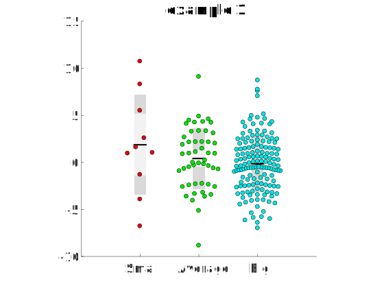
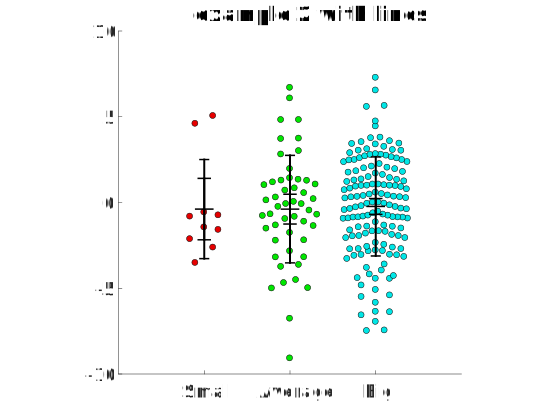

# Univarscatter [](https://fr.mathworks.com/matlabcentral/fileexchange/54243-univarscatter)

Draw an **univariate scatter plot** out of a nx2 table with a
categorical/string and a numerical variable, or out of a
numerical array, with groups/categories corresponding
to the columns of the numerical array. The function returns the `(x,y)` coordinates of the dots, so you can use them for custom plotting. If you use this function in a public webpage or publication, I encourage you to share the reference with me so that I include it in the publications section.

This kind of graph is very popular in biochemistry/biology
papers.



## Basic usage
```matlab

% Generate 3 normal COLUMN VECTORS of different lengths
smallset=normrnd(0,3,[10,1]);
averageset=normrnd(0,3,[50,1]);
bigset=normrnd(0,3,[150,1]);

%Concatenate them, and fill the empty ones with nans, keep in mind that you
%can do this much faster with the function padcat (see extra functions)

DataArray=nan(size(bigset,1),3);
DataArray(1:length(smallset),1)=smallset;
DataArray(1:length(averageset),2)=averageset;
DataArray(1:length(bigset),3)=bigset;

figure
UnivarScatter(DataArray,'Label',{'Small','Average','Big'});
```

## Customizing the graph

Many custom options are available as `Name,Value`
pairs.
For optimal visualization of your data I
recommend to play with `RangeCut`, and also with `pbaspect` of the plot, it
really changes the appearance.

## Extra functions
You need the following functions for this function to work:

* `CatTable2Array` included here.

Also, a very simple function to assign colors is
provided, `ColorCoder`, you can see several examples in the
script `UnivarScatterExamples.m`.

A useful function to create the input of the function from columns of different lengths is the function `padcat` ([link](https://fr.mathworks.com/matlabcentral/fileexchange/22909-padcat))

All your feedback is welcome to improve this function

## Publications using Univarscatter

Here are some publications that use `UnivarScatter`. If you know of more please let me know!

Bürgi, J., Abrami, L., Castanon, I., Abriata, L. A., Kunz, B., Yan, S. E., … van der Goot, F. G. (2020). Ligand Binding to the Collagen VI Receptor Triggers a Talin-to-RhoA Switch that Regulates Receptor Endocytosis. Developmental Cell, 53(4), 418-430.e4. https://doi.org/10.1016/j.devcel.2020.04.015

Bailles, A., Collinet, C., Philippe, J. M., Lenne, P. F., Munro, E., & Lecuit, T. (2019). Genetic induction and mechanochemical propagation of a morphogenetic wave. Nature, 572(7770), 467–473. [https://doi.org/10.1038/s41586-019-1492-9](https://doi.org/10.1038/s41586-019-1492-9
)

Rozenfeld, E., Lerner, H., & Parnas, M. (2019). Muscarinic Modulation of Antennal Lobe GABAergic Local Neurons Shapes Odor Coding and Behavior. Cell Reports, 29(10), 3253–3265.e4. [https://doi.org/10.1016/j.celrep.2019.10.125](https://doi.org/10.1016/j.celrep.2019.10.125)

Thomas, C. I., Keine, C., Okayama, S., Satterfield, R., Musgrove, M., Guerrero-Given, D., … Young, S. M. (2019). Presynaptic mitochondria volume and abundance increase during development of a high-fidelity synapse. Journal of Neuroscience, 39(41), 7994–8012. [https://doi.org/10.1523/JNEUROSCI.0363-19.2019](https://doi.org/10.1523/JNEUROSCI.0363-19.2019)

Taylor, P. N., Sinha, N., Wang, Y., Vos, S. B., de Tisi, J., Miserocchi, A., … Duncan, J. S. (2018). The impact of epilepsy surgery on the structural connectome and its relation to outcome. NeuroImage: Clinical, 18(January), 202–214. [https://doi.org/10.1016/j.nicl.2018.01.028](https://doi.org/10.1016/j.nicl.2018.01.028)

Sinha, N., Wang, Y., Dauwels, J., Kaiser, M., Thesen, T., Forsyth, R., & Taylor, P. N. (2019). Computer modelling of connectivity change suggests epileptogenesis mechanisms in idiopathic generalised epilepsy. NeuroImage: Clinical, 21(December 2018), 101655. [https://doi.org/10.1016/j.nicl.2019.101655](https://doi.org/10.1016/j.nicl.2019.101655)

Thomas Hannich, J., Mellal, D., Feng, S., Zumbuehl, A., & Riezman, H. (2017). Structure and conserved function of iso-branched sphingoid bases from the nematode: Caenorhabditis elegans. Chemical Science, 8(5), 3676–3686. [https://doi.org/10.1039/c6sc04831e](https://doi.org/10.1039/c6sc04831e)

Chromosome segregation is driven by joint microtubule sliding action of kinesins KIF4A and EG5
Kruno Vukušić, Renata Buđa, Ivana Ponjavić, Patrik Risteski, Iva M. Tolić
bioRxiv 863381; doi: [https://doi.org/10.1101/863381](https://doi.org/10.1101/863381)

Coevolution of structural variation and optimization in sound systems of human language
Meng-Han Zhang, Tao Gong
bioRxiv 346965; doi: [https://doi.org/10.1101/346965](https://doi.org/10.1101/346965)

Wang, Y., Sinha, N., Schroeder, G. M., Ramaraju, S., McEvoy, A. W., Miserocchi, A., … Taylor, P. N. (2020). Interictal intracranial electroencephalography for predicting surgical success: The importance of space and time. Epilepsia, 61(7), 1417–1426. https://doi.org/10.1111/epi.16580

Manenica, M., Koprivec, I., Štimac, V., Simunić, J., & Tolić, I. M. (2020). Augmin regulates kinetochore tension and spatial arrangement of spindle microtubules by nucleating bridging fibers. BioRxiv, 2020.09.10.291740. https://doi.org/10.1101/2020.09.10.291740

Taylor, P. N., Moreira da Silva, N., Blamire, A., Wang, Y., & Forsyth, R. (2020). Early deviation from normal structural connectivity: A novel intrinsic severity score for mild TBI. Neurology, 94(10), e1021–e1026. https://doi.org/10.1212/WNL.0000000000008902

Israel, S., Rozenfeld, E., Weber, D., Huetteroth, W., & Parnas, M. (2020). Two Parallel Pathways Mediate Olfactory-Driven Backward Locomotion. BioRxiv, 2020.11.23.393819. https://doi.org/10.1101/2020.11.23.393819

Trupinić, M., Ponjavić, I., Kokanović, B., Barišić, I., Šegvić, S., Ivec, A., & Tolić, I. M. (2020). Twist of the mitotic spindle culminates at anaphase onset and depends on microtubule-associated proteins along with external forces. BioRxiv, 2020.12.27.424486. https://doi.org/10.1101/2020.12.27.424486

Popescu, T., Widdess, R., & Rohrmeier, M. (2020, December 20). Western listeners detect boundary hierarchy in Indian music: a segmentation study (Popescu et al. 2020, Scientific Reports). https://doi.org/10.31234/osf.io/q9f7e

Goodarzi, S., Prunet, A., Rossetti, F., Tillement, O., Porcel, E., & Lacombe, S. (2021). Quantifying nanotherapeutics penetration using hydrogel based microsystem as a new 3D in-vitro platform, 1–29. https://doi.org/10.1101/2021.01.17.427020

## Examples

You can find a handful of examples in the file `UnivarScatterExamples.m` . In the folder `examples` there are some other examples shared by users of `UnivarScatter`, see `examples/examples.md`.


## Similar functions
In Mathworks I came across a function that does something very similar to this, `plotSpread`([link](http://www.mathworks.com/matlabcentral/fileexchange/37105-plot-spread-points--beeswarm-plot-))
