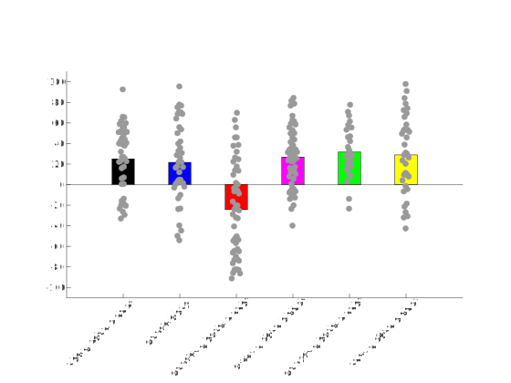
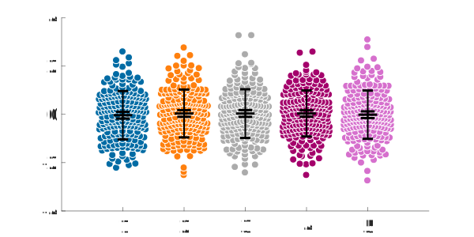
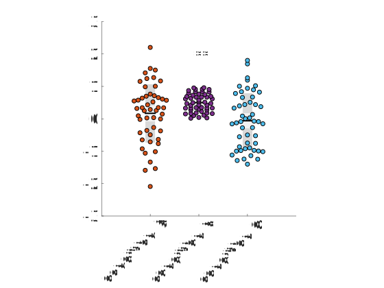
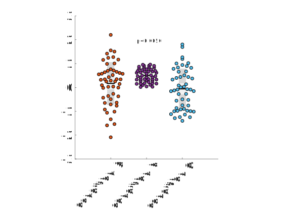

# Examples

You can find a handful of examples in the file `UnivarScatterExamples.m` . Here there are some other examples shared by users of `UnivarScatter`.

## Example 1: Rozenfeld et al. 2019

Combining a bar plot with the dots. See `Rozenfeld2019/Figure_4E.m`.

## Example 2: A crowded plot

When you have many values, it might be interesting to show the borders of dots in white. See `crowdedPlot`.

## Example 3: Representing statistical significance

You can use the function `drawStars`, included in the repository, or use it for inspiration.

